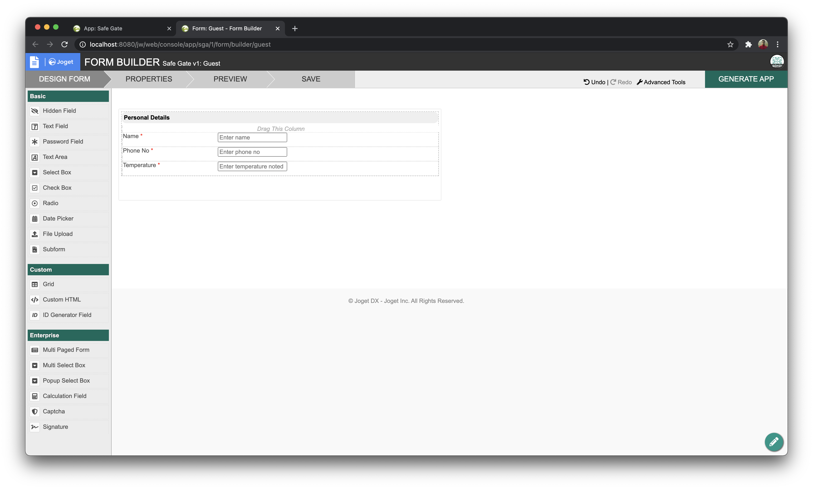
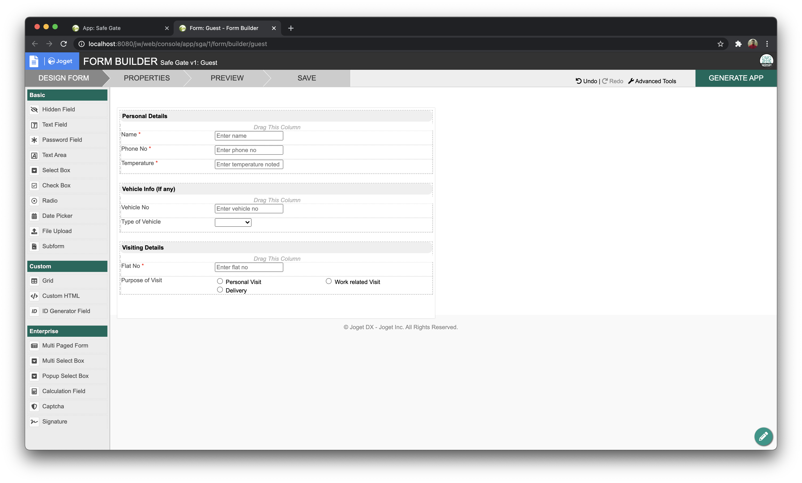

# Build a process driven SafeGate App with Joget Operator hosted on Red Hat OpenShift

## Introduction

In this tutorial you will learn how to build a gate security application that has a visitor and owner, visitor requests to enter premises, and the owner approves the request. You will learn to build this process-driven application with Joget Operator on Red Hat OpenShift. You will learn the four components of Joget.

## About Joget Operator

Joget is an open source no-code / low-code application platform through which Rapid Application Development, Business Process Automation and Workflow Management can be done easily.Joget has four main components namely; Form, Data Lists, Process and User View.[Learn more](https://marketplace.redhat.com/en-us/products/joget-dx).

## Prerequisites

1. [Red Hat Marketplace account](https://marketplace.redhat.com/en-us/registration/om)
2. [Red Hat OpenShift Cluster](https://cloud.ibm.com/docs/openshift?topic=openshift-getting-started)
3. [OpenShift container & kubectl CLI](https://docs.openshift.com/container-platform/4.5/cli_reference/openshift_cli/getting-started-cli.html)

## Estimated time

Completing this tutorial should take about 30 minutes.

## Steps

### Step 1: Install the Joget Operator from Red Hat Marketplace on OpenShift Cluster

Follow the steps in this tutorial to deploy a Joget Operator from Red Hat Marketplace on an OpenShift Cluster:

- [Joget on Red Hat Marketplace](https://dev.joget.org/community/display/DX7/Joget+on+Red+Hat+Marketplace)

- Once you have successfully set up a Joget Operator on an OpenShift Cluster you can access it by visiting the route that you will have created.

### Step 2: Login to Joget

### Step 3: Create an Application

- Click on **Design New App** to get started. Enter an app ID and app Name. We will have the ID as `sga` and name as `Safe Gate`.

- Click on **Create New Form**. Enter the Form ID, Form Name and Table Name as shown and click on **Save**.

- A Form Builder will open up in new tab as shown.

#### Step 3.1: Building Form

- Lets build the first component in Joget which is **Forms**. 

- In Form Builder, you can add Text Field, Password Field, Text Area, Select Box, Radio, etc.. 

- To build a guest check in form we would require the basic info of guest, their purpose of visit and some other info such as vehicle details if they have any.

- In the first section we will record **Personal Details** of the guest. 

- Add the Text Field by draging it into the canvas, click on the pencil button to edit, enter ID, Name of the text field and Placeholder as shown.

- Similarly add two more Text fields namely; Phone Number and Temperature.

>NOTE: You can add validator to the text field to make it a mandatory field. click on the pencil to edit, and under _Advanced Options > Data > Encryption_ select the **Default Validator** and click on save as shown.

- In the second section we will record **Vehicle Info (If any)** of the guest.

- To create a new section, simply click on the **+** button in the canvas, click on the pencil to rename it as shown.

- Add a text field and name it as **Vehicle No** to record vehicle number.

- Add a Select Box, name it as **Type of Vehicle** and hardcode 2 options `2 Wheeler` and `4 Wheeler` as shown.

>Note: Getting the values dynamically in the select box is out of scope for this tutorial.

- In the third and final section we will record **Visiting Details** of the guest.

- To create a new section, simply click on the **+** button in the canvas, click on the pencil to rename it as **Visiting Details**.

- Add a text field and name it as **Flat No** to record flat number the guest is planing to visit.

- Add a Radio for **Purpose of Visit** and hardcode 3 options `Personal Visit`, `Work Related Visit` and `Delivery` as shown.

- Once completed you will have a form layout as shown.

- Click on the **Save** button to save the changes.

## Summary
State any closing remarks about the task or goal you described and its importance. Reiterate specific benefits the reader can expect from completing your tutorial. Recommend a next step (with link if possible) where they can continue to expand their skills after completing your tutorial.
## Related links
Include links to other resources that may be of interest to someone who is reading your tutorial.
